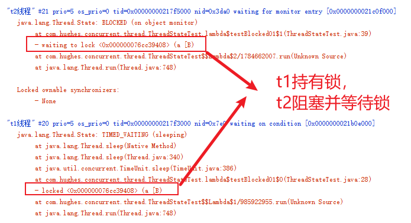
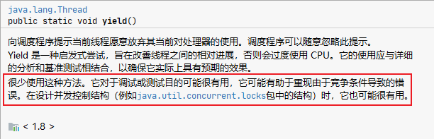

#  线程详谈

> 在Java程序中，线程是执行单元。简单来说多线程的目的，是为了实现并发以更高效地利用CPU资源，另外能够模拟多角色协同作业的现实场景。

## 线程状态

### doc中的描述


### 变化关系


### BLOCKED状态

特别讲一下BLOCKED，分为两种情况

```java
public enum State {
  /**
   * Thread state for a thread blocked waiting for a monitor lock.
   * A thread in the blocked state is waiting for a monitor lock
   * to enter a synchronized block/method or
   * reenter a synchronized block/method after calling
   */
   BLOCKED,
}
```
> 释义: 线程阻塞等待监视器锁的线程状态。处于阻塞状态的线程正在等待监视器锁进入同步块/方法或在调用Object.wait后重新进入同步块/方法

运行情况一示例代码，借助visualVM工具观测线程状态
```java
@Slf4j
public class ThreadStateTest{
    /**
     * Blocked 状态情形一：线程阻塞等待监视器锁的线程状态（Thread state for a thread blocked waiting for a monitor lock.）
     */
    @Test
    public void testBlocked01() {
        byte[] lock = new byte[0];
        Thread t1 = new Thread(() -> {
            synchronized (lock) {
                log.info("t1 has get lock...");
                for (int i = 0; i < 100; i++) {
                    try {
                        TimeUnit.SECONDS.sleep(3);
                    } catch (InterruptedException e) {
                        e.printStackTrace();
                    }
                }
                log.info("t1 is end");
            }
        }, "t1线程");
        Thread t2 = new Thread(() -> {
            log.info("t2 is start");
            synchronized (lock) {
            log.info("t2 is end");
            }
        }, "t2线程");
        t1.start();
        TimeUnit.MICROSECONDS.sleep(100);//保证t1已启动
        t2.start();
        TimeUnit.SECONDS.sleep(200);//给visualVM足够时间浏览
        Assert.assertEquals(Thread.State.BLOCKED,t2.getState());
    }
}
```



情况二比较复杂，首先wait和notify时，调用线程必须持有该对象的监视器锁，所以t2线程在进入同步块前会和上一个情况一样blocked等待获取锁资源，当获取锁资源后wait方法会使t2线程进入到waiting状态，同时会将资源锁释放掉，**当有收到notify信号唤醒t2线程时，t2线程会重新进入（reenter）同步块而进入blocked状态等待锁资源**

```java
@Slf4j
public class ThreadStateTest{
    /**
     * Blocked 状态情形二：处于阻塞状态的线程正在等待监视器锁进入同步块/方法或在调用Object.wait后重新进入同步块/方法
     * （ A thread in the blocked state is waiting for a monitor lock to enter a synchronized block/method
     *  or reenter a synchronized block/method after calling）
     */
    @Test
    public void testBlocked02() {
        byte[] lock2 = new byte[0];
        Thread t1 = new Thread(()->{
             try {
                synchronized (lock2){
                    log.info("step1： t1获取到lock,t2将在wait前 blocked 30s");
                    TimeUnit.SECONDS.sleep(30);//t2 BLOCKED waiting to lock lockPath
                    log.info("step2： t1释放lock...");
                }
                TimeUnit.MILLISECONDS.sleep(100);//保证t2能够获取到资源
                synchronized (lock2){
                    log.info("step4: t1再次获取lock,将在30s后notify t2");
                    TimeUnit.SECONDS.sleep(30);//t2 WAITING waiting on lock , locked lockPath
                    lock2.notify();
                    log.info("step5: t2被notify,状态由wait切换至blocked,t1将在60s后释放lock");
                    TimeUnit.MINUTES.sleep(1);//t2 BLOCKED waiting on lock , locked lockPath
                }
            } catch (Exception e) {
                e.printStackTrace();
            }
        },"t1线程");

        Thread t2 = new Thread(() -> {
            try {
                synchronized (lock2){
                    log.info("step3： t2 获取到lock,将wait并释放lock");
                    lock2.wait();
                    log.info("step6: t2 is end");
                }
            } catch (Exception e) {
                e.printStackTrace();
            }
        },"t2线程");
        t1.start();
        TimeUnit.MILLISECONDS.sleep(100);//保证t1能够获取到资源
        t2.start();
        TimeUnit.MINUTES.sleep(3);
    }
}
```

## 创建方式
> 线程创建的几种方式,这里简要提一下
### 继承Thread
继承Thread类，重写run方法
### 实现Runnable
实现Runnable接口作为Thread的构造参数创建
### FutureTask
FutureTask本身实现了Runnable接口，在调用get方法时会阻塞等待线程计算完成并返回结果
### 借助线程池
严格来说线程的创建只有继承和实现两种，但线程创建与销毁对于系统开销比较大，在开发之中都会选择线程池化的形式，关于线程池的原理在后面的文章会讲解。
线程池的execute和submit对应着Runnable和FutureTask形式，awaitTermination方法会关闭请求阻塞并等待任务执行结束
```java
public class ThreadCreateTest {
    @Test
    public void poolCreate() {
        ExecutorService pool = Executors.newCachedThreadPool();
        String expect = "ok";
        pool.execute(new MyRunnableImpl());
        Future<String> future = pool.submit(new MyCallAbleImpl<>(expect));//构造参即为返回值
        pool.awaitTermination(100, TimeUnit.MILLISECONDS);
        Assert.assertEquals(expect,future.get());
    }
}
```
## 方法
### 中断interrupt


线程在wait/join/sleep/io 阻塞时interrupt会抛出interruptException;
interrupt 不会立刻中断线程的进程,而且通过Thread.isInterrupted()来判断线程是否处于中断状态,用于编程者根据实际情况判断返回或者进行其他的执行逻辑；
> 此处心声疑问：处于中断状态的线程,进行sleep/wait/join操作是否能够执行,还是会抛出异常,之后是的中断状态是否会被重置,我们来验证一下
```java
@Slf4j
public class ThreadMethodTest {

    @Test
    public void testInterrupt() throws InterruptedException {
        Thread t1 = new Thread(()->{
            log.info("t1 is run...");
            Thread t = Thread.currentThread();
            try {
                t.interrupt();
                log.info("t1 线程中断状态：" + t.isInterrupted());//true
                TimeUnit.SECONDS.sleep(1); //InterruptedException: sleep interrupted
            } catch (Exception e) {
                e.printStackTrace();
                log.info("异常 t1 线程中断状态：" + t.isInterrupted());//false
                try {
                    TimeUnit.SECONDS.sleep(1);
                    log.info("异常后sleep成功");
                } catch (Exception e2) {
                    e2.printStackTrace();
                }
            }
            log.info("t1 is end...");
        },"t1线程");
        t1.start();
        t1.join();
    }
}

```
> 结果处于中断状态的线程，进行sleep/wait/join操作会抛出异常，同时会重置中断状态

日常开发中interrupt的使用会很少，但在框架以及多线程源码中，会经常出现它的身影，interrupt相当于一个线程运行其他执行者对它进行的标记，编程者可以依据此来决定该线程的执行走向，也可以算作线程通讯的一种形式。
### join

join 会等待当前线程执行结束
join 方法源码: 
```java
public class Thread{
     public final synchronized void join(long millis)
     throws InterruptedException {
         //...
         if (millis == 0) {
             while (isAlive()) {
                 wait(0);
             }
         } 
        //...
     }
}
```
join 方法相当于主线程使用子线程对象调用了wait方法，所以主线程会进入到wait状态等待唤醒，子线程执行结束后，JVM会执行notify_all指令，此时就会唤醒主线程

### yield

doc 解释很到位



