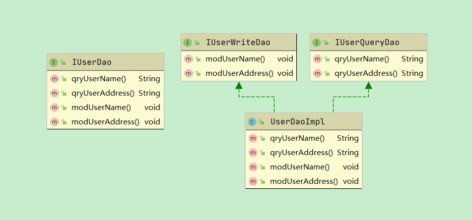

## 单一职责原则 Simple-Responsibility-Principle

### 定义

- 一个单元如Model/Class/Interface/Method 只负责一个职责，不能存在多于一个导致其变更的原因

------
### 举例

#### Method

用户 User 有改变信息的modUserInfo方法

```java
public class User {

    private String name;

    private String address;


    public void modUserInfo(String... fields){
        this.name = fields[0];
        this.address = fields[1];
    }
}
```

modUserInfo方法承担了多种职责，所以不符合单一职责原则，应当拆解这个方法

```java
    public void modUserName(String username){
        this.name = username;
    }

    public void modAddress(String address){
        this.address = address;
    }
```

#### Interface

定义IUserDao的接口,拥有以下方法

```java
public interface IUserDao {

    String qryUserName();

    String qryUserAddress();

    void modUserName();

    void modUserAddress();
}
```

读写分离拆分接口

```java
public interface IUserQueryDao {

    String qryUserName();

    String qryUserAddress();
}

public interface IUserWriteDao {
    void modUserName();

    void modUserAddress();
}
```

uml图



#### Class

任务处理TaskHandler基于任务类型而进行不同的处理

```java
public class TaskHandler {
    
    public void handler(String taskType){
        if ("行为型".equals(taskType)){
            System.out.println("保存图片");
        }else {
            System.out.println("不保存图片");
        }
    }
}
```

存在代码逻辑影响的风险，应当拆解这个类

```java
public class BehaviorTaskHandler {

    public void handler() {
        System.out.println("处理行为型任务保存图片");
    }
}

public class DiscernTaskHandler {

    public void handler() {
        System.out.println("处理检测型任务不保存图片");
    }
}
```


------

### 个人心得

- 单一职责原则能够降低类的复杂度，提高代码的可读性和系统的维护性
- 若开发时偷懒造成的“万能类”、“万能方法”，在维护或变更时N倍的还回来，切莫短视
- 随着项目的版本迭代，理想型的单一职责原则难以为继，将逻辑末枝拆分的过细导致了逻辑链的拉长，当末枝成长为枝干时，牵连了诸多结构又难以重构，是开发之中经常遇到的痛点。期望着将来随着接触的技术广度和深度增长时，能有新的感悟。


